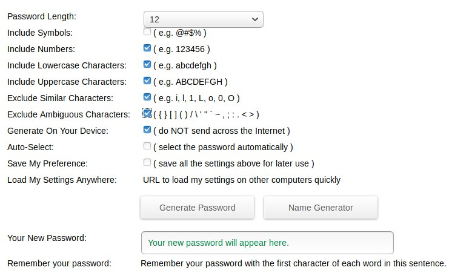

# Setting up a new User in CiviCRM

This is required for each scanner device being put into service. Each scanner needs to have it own dedicated User in CiviCRM so that a secure User api_key is created for the device to access CiviCRM records.

## Generating a new password

Visit https://passwordsgenerator.net/

Make selection of options as shown below

Take a copy with COPY-PASTE or screen shot or both. Save to private location.

## Instructions for adding new user.

Login to melbpc.org.au as user with (admin rights??)

Mouse over 'Melbourne PC User Group' and select 'Dashboard'.

Mouse over 'Users' in the LH menu and select Add New. See AddNewUser.png

Enter a Username in format "scanner.<location>"

Enter an email address.

Enter a First Name like scanner.X

Click on 'Show password' and paste in password created above.

Select `Scanner` from Roles list.

Click on "Add New User".

## Create User Api_key

Select User in LH menu.

Enter "scanner" in search bar (without quotes) and press Search Users

Select the new scanner User just created.

Click on link 'View Contact in CiviCRM'.

Click on tab 'API Key' located halfway down the page.

Create new API key and save to a secure private location.

Take a copy to paste elsewhere.

### This API Key will need to be pasted into the file api_keys.json as the User Key.
### The Site Key for the location will also need to be pasted in to this same file as the Site Key.
